# TradeMate


**TradeMate** is a modern, mobile-first marketplace app for students to buy, sell, and chat about second-hand items within their campus or hostel community.

---
##Screenshots at the end of the file.
---

## 🚀 Features

- **Browse & Post Products:** List items for sale with images, price, and details.
- **Category Browsing:** Filter products by categories like Electronics, Books, Fashion, Sports, Furniture, and Others.
- **Wishlist:** Add items to your wishlist for quick access later.
- **Real-Time Chat:** Secure, instant messaging between buyers and sellers.
- **Profile Management:** Edit your profile and manage your listings.
- **Responsive UI:** Looks great on all screen sizes.
- **Splash Screen:** Clean splash screen on app launch.
- **Secure Auth:** User authentication with Supabase.
- **Logout:** Securely log out from your account.

---

## 🛠️ Tech Stack

- **React Native (Expo)**
- **Supabase** (Auth, Database, Realtime)
- **React Navigation**
- **Expo Linear Gradient & Vector Icons**

---

## 📝 Getting Started

### Prerequisites

- [Node.js](https://nodejs.org/)
- [Expo CLI](https://docs.expo.dev/get-started/installation/)
- A [Supabase](https://supabase.com/) project

### Installation

1. **Clone the repository:**
    ```sh
    git clone https://github.com/yourusername/trademate.git
    cd trademate
    ```

2. **Install dependencies:**
    ```sh
    npm install
    ```

3. **Set up environment variables:**

    Create a `.env` file in the root directory:

    ```
    EXPO_PUBLIC_SUPABASE_URL=your-supabase-url
    EXPO_PUBLIC_SUPABASE_ANON_KEY=your-supabase-anon-key
    ```

    > **Note:** Never commit your `.env` file to GitHub.

4. **Start the Expo app:**
    ```sh
    npx expo start
    ```

---

## ⚡ Usage

- **Sign up or log in** with your email.
- **Browse products** or use categories to filter.
- **Add new products** for sale from your profile.
- **Chat** with sellers or buyers in real time.
- **Add items to your wishlist** for later.
- **Edit your profile** and manage your listings.

---

## 📂 Project Structure

```
my-app/
├── assets/                # Images and icons
├── src/
│   ├── components/        # Reusable UI components
│   ├── contexts/          # Context providers (e.g., Wishlist)
│   ├── lib/               # Supabase client setup
│   ├── navigation/        # Navigation setup
│   └── screens/           # App screens (Home, Login, Signup, Profile, etc.)
├── .env                   # Environment variables (not committed)
├── App.js                 # App entry point
├── app.json               # Expo config
└── README.md
```

---

## 🔒 Security

- **Never share your `.env` file or Supabase keys publicly.**
- All sensitive files are listed in `.gitignore`.

---

## 🤝 Contributing

Contributions are welcome! Please open an issue or submit a pull request.

---

## 📄 License

This project is licensed under the MIT License.

---

## 👤 Author

**Yuvraj Yadav**  
**cst.23bctb19@silicon.ac.in**

---

> _TradeMate – Making campus trading easy, safe, and fun!_
---
## 📱 Screenshots

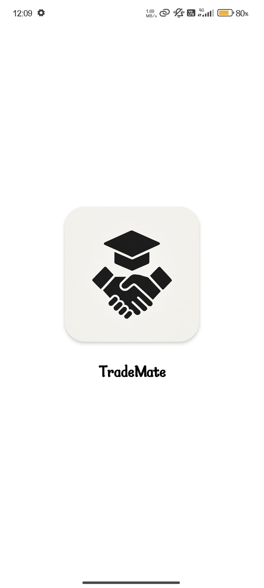 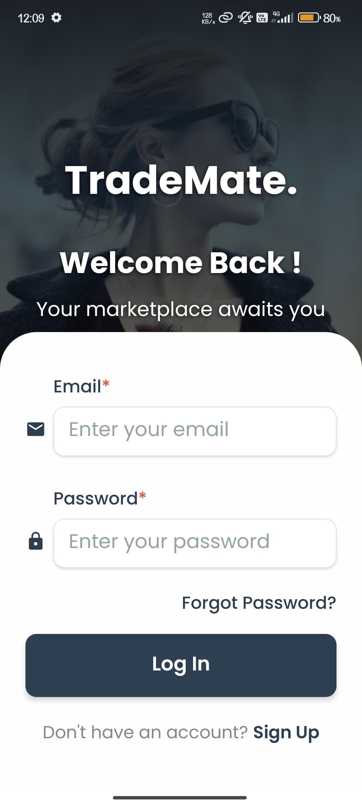 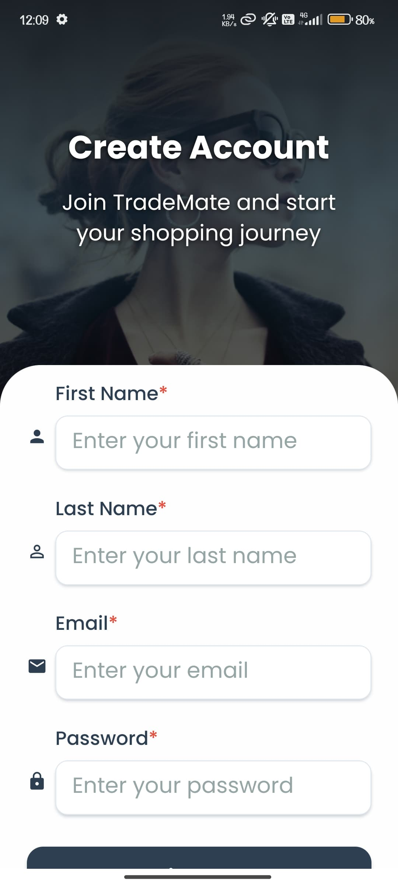
 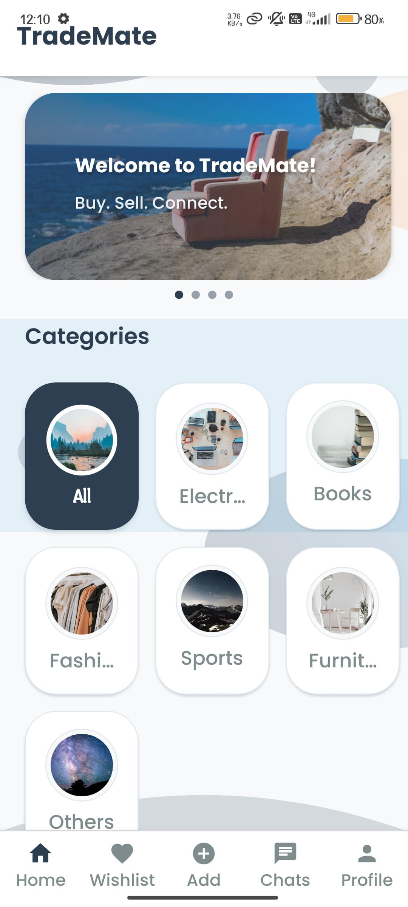
 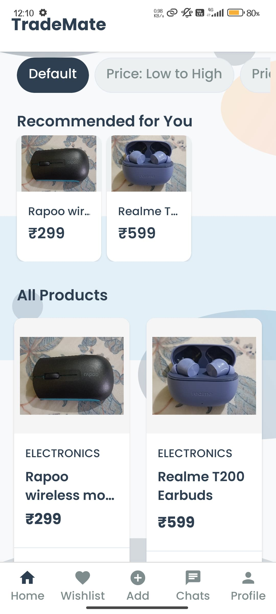
 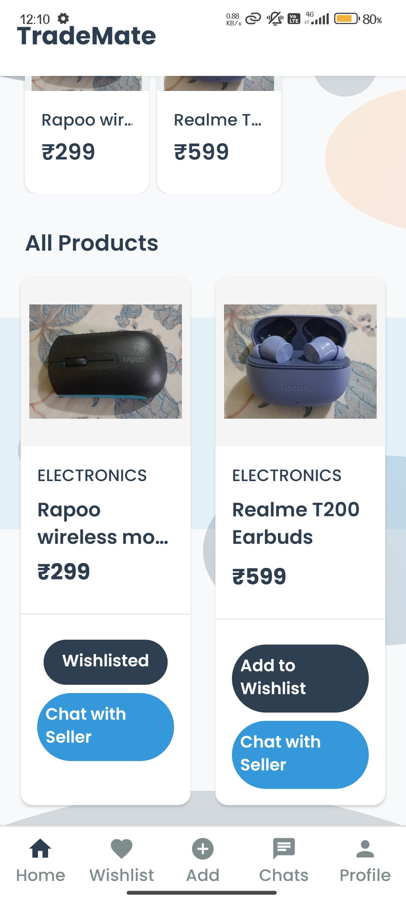
 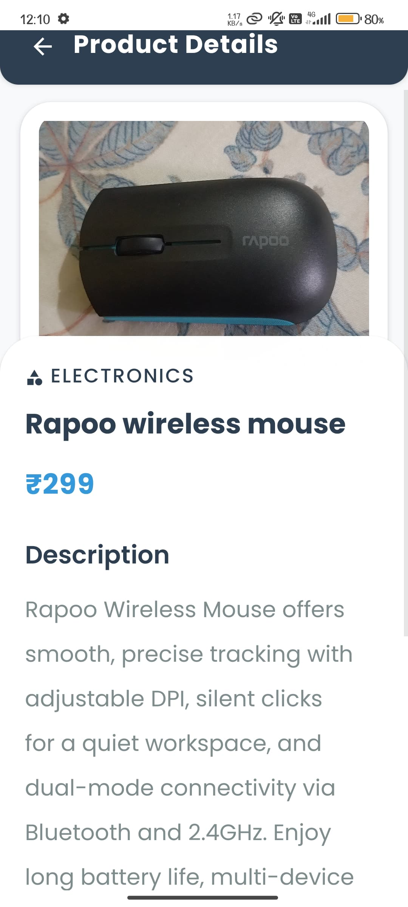
 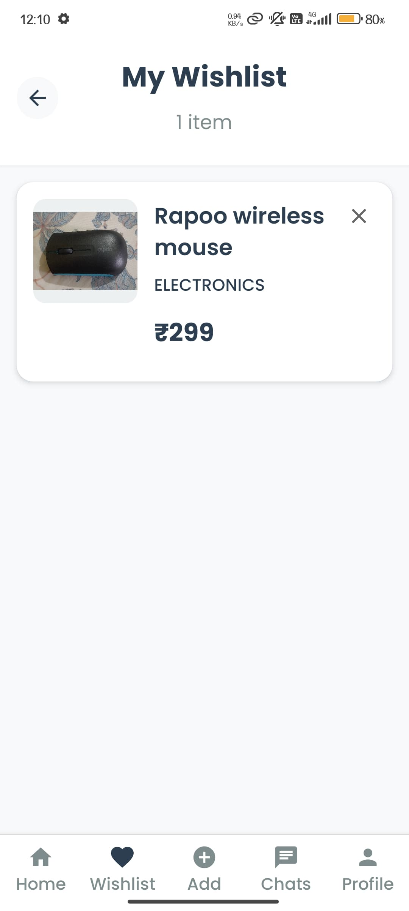
 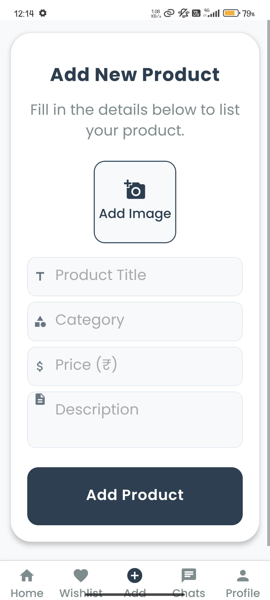
 
 
 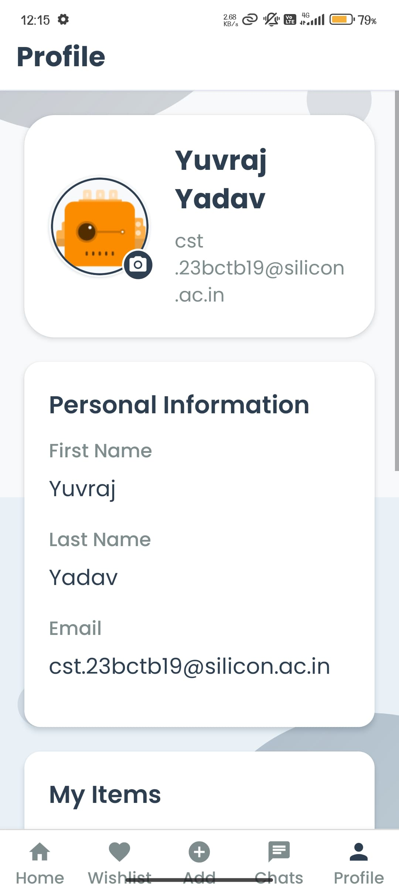
 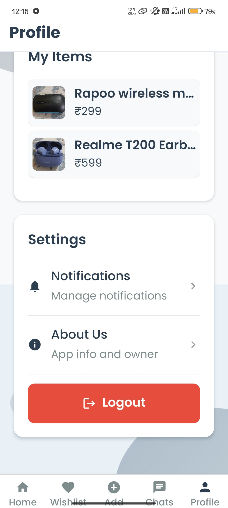
 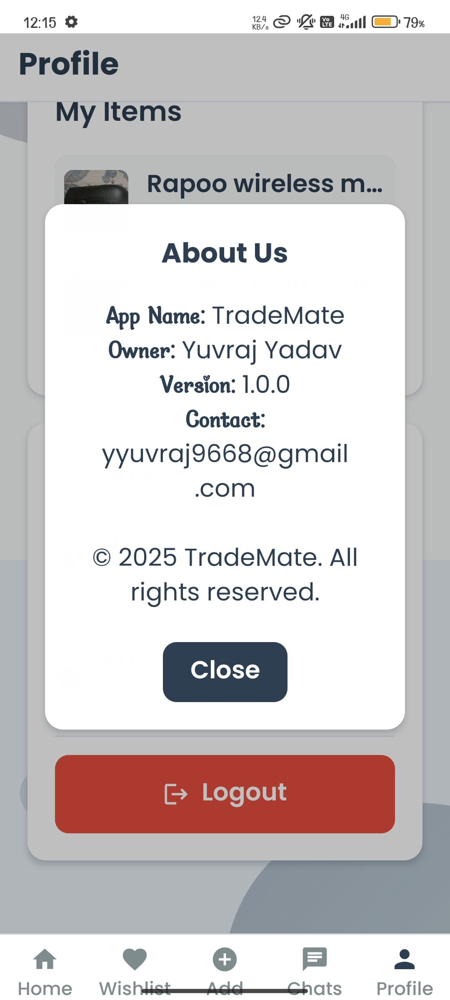
 
---
